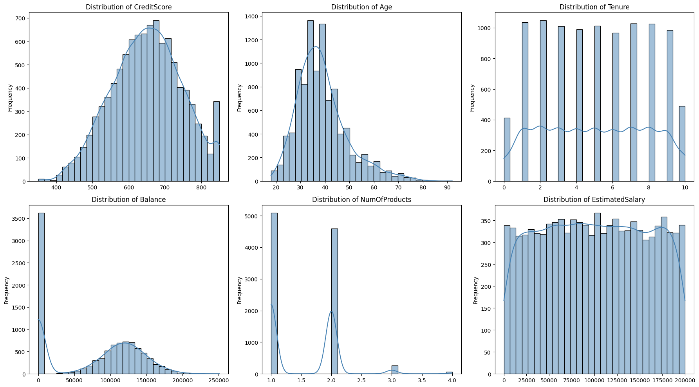
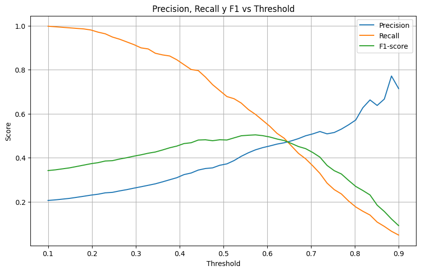

# Bank Customer Churn Prediction
This project aims to build a predictive model to identify bank customers at high risk of churning (i.e., closing their accounts). By leveraging machine learning techniques and customer profile data, we propose a data-driven approach to improve retention strategies and reduce revenue loss due to customer attrition.

Kaggle link: https://www.kaggle.com/datasets/shrutimechlearn/churn-modelling

# Business Context
XYZ Bank is a retail banking institution operating in France, Spain, and Germany. It offers a range of financial products including checking and savings accounts, credit cards, and investment services. Recently, the bank has observed a rise in customer churn, with a significant proportion of attrition occurring in the 30–60 age group.

- **Overall churn rate**: 4.2%
- **High-risk age segment**: 30–60 years old (88.27% of all churn cases)
- **Economic impact**: Based on industry benchmarks, the average customer lifetime value (LTV) is estimated at €1,800, and the customer acquisition cost (CAC) at €400. This implies a net loss of €1,400 for every customer who leaves the bank.

### Project Objectives

The project has both business and technical goals:

- **Business Objective**: Deploy a predictive system within the bank’s CRM that automatically triggers proactive retention protocols. These may include personalized offers, benefit adjustments, or alerts for at-risk customers based on model-driven segmentation.

- **Analytical Objective**: Develop a machine learning model with at least **85% prediction accuracy** to classify customers by churn risk. The goal is to reduce the overall churn rate by **at least 10%** over the next six months. The final model should be deployment-ready by the end of the current fiscal quarter.

### Dataset Overview

This dataset consists of 10,000 customer records from XYZ Bank. Each row represents a client and contains demographic, financial, and behavioral features. The target variable is `Exited`, indicating whether the customer has left the bank.

**Features:**


| Feature          | Type        | Description                                                  |
|------------------|-------------|--------------------------------------------------------------|
| `RowNumber`      | Integer     | Row index (for internal reference)                          |
| `CustomerId`     | Integer     | Unique ID assigned to each customer                         |
| `Surname`        | Text        | Customer’s last name                                        |
| `CreditScore`    | Integer     | Credit score assigned by the bank                           |
| `Geography`      | Categorical | Country of residence (France, Germany, Spain)               |
| `Gender`         | Categorical | Customer’s gender                                           |
| `Age`            | Integer     | Age of the customer                                         |
| `Tenure`         | Integer     | Number of years the customer has been with the bank         |
| `Balance`        | Float       | Account balance in euros                                    |
| `NumOfProducts`  | Integer     | Number of financial products used by the customer           |
| `HasCrCard`      | Binary      | Whether the customer owns a credit card (1 = Yes, 0 = No)   |
| `IsActiveMember` | Binary      | Whether the customer is considered active (1 = Yes, 0 = No) |
| `EstimatedSalary`| Float       | Estimated yearly salary                                     |
| `Exited`         | Binary      | Target variable: 1 if the customer left the bank, 0 if not  |

### 🔍 Exploratory Data Analysis (EDA)

Before beginning the analysis, we performed a basic data quality audit to ensure the dataset was suitable for modeling. We checked for missing values and found that all columns were complete, with zero null values across the entire dataset (10,000 records and 14 variables). This allowed us to proceed without requiring imputation or row removal.

**Steps:**

```python
# Check for missing values
data.isnull().sum()

# Check for duplicated rows
data.duplicated().sum()

# Basic statistics
data.describe()
```

We validated that the dataset has no missing values across any feature:

| Feature           | Missing Values |
|------------------|----------------|
| RowNumber         | 0              |
| CustomerId        | 0              |
| Surname           | 0              |
| CreditScore       | 0              |
| Geography         | 0              |
| Gender            | 0              |
| Age               | 0              |
| Tenure            | 0              |
| Balance           | 0              |
| NumOfProducts     | 0              |
| HasCrCard         | 0              |
| IsActiveMember    | 0              |
| EstimatedSalary   | 0              |
| Exited            | 0              |


### Univariate Statistical Summary

To better understand the distribution and characteristics of the dataset’s **numerical variables**, we computed basic descriptive statistics:

| Variable         | Mean      | Median    | SD        | CV (Mean) | CV (Median) | Skewness | Kurtosis | Min     | Max        | Range      |
|------------------|-----------|-----------|-----------|------------|--------------|----------|-----------|----------|-------------|------------|
| CreditScore      | 650.53    | 652.00    | 96.65     | 0.15       | 0.15         | -0.07    | -0.43     | 350.00   | 850.00      | 500.00     |
| Age              | 38.92     | 37.00     | 10.49     | 0.27       | 0.28         | 1.01     | 1.39      | 18.00    | 92.00       | 74.00      |
| Tenure           | 5.01      | 5.00      | 2.89      | 0.58       | 0.58         | 0.01     | -1.17     | 0.00     | 10.00       | 10.00      |
| Balance          | 76,485.89 | 97,198.54 | 62,397.40 | 0.82       | 0.64         | -0.14    | -1.49     | 0.00     | 250,898.09  | 250,898.09 |
| NumOfProducts    | 1.53      | 1.00      | 0.58      | 0.38       | 0.58         | 0.74     | 0.58      | 1.00     | 4.00        | 3.00       |
| EstimatedSalary  | 100,090.24| 100,193.91| 57,510.49 | 0.57       | 0.57         | 0.00     | -1.18     | 11.58    | 199,992.48  | 199,980.90 |

## Distribution of Numeric Variables



### Univariate Analysis – Key Insights of numeric variables

- **Balance:**  
  Average of €76,486 and standard deviation of €62,397 indicate **high dispersion**.  
  Slightly negative skewness (-0.14) and negative kurtosis (-1.48) suggest a **slightly left-skewed distribution** with thinner tails than a normal curve.  
  Several values are zero → may represent **clients with no active funds**, which could be relevant for churn prediction.

- **Age:**  
  Mean age is 38.9 years, with **positive skewness** (1.01) and **moderate kurtosis** (1.39).  
  The distribution leans toward younger clients but includes a **long tail of older customers**.  
  Ranging from 18 to 92 → age can be **segmented into groups** (e.g., young, adults, seniors) for churn analysis.

- **NumOfProducts:**  
  Mean is 1.53 with a median of 1 → most customers hold **only 1 or 2 products**.  
  Positive skewness (0.74) shows that **few customers have 3 or more products**.  
  This feature may reflect **relationship depth** or customer loyalty.

- **CreditScore:**  
  The distribution is **quite symmetric and stable** (skew ≈ 0, CV ≈ 0.15).  
  Ranges between 350 and 850, with no evident outliers → **clean and ready for modeling**.

- **EstimatedSalary:**  
  Average around €100,000 but with a **very wide range** (from €11.5 to €199,992).  
  No significant skewness → although due to high dispersion, **scaling or normalization** may be needed when using models sensitive to feature magnitude.
  
### Outlier Analysis

We performed boxplot-based outlier detection using the IQR method for key numerical features:

- **Age:**  
  - Detected **359 outliers** (3.59% of the dataset).  
  - Among them, **73 customers churned**, representing ~20.3%, slightly below the overall churn rate.  
  - These values mostly correspond to elderly customers (ages 61+), a minority group in the dataset.  
  - **Decision:** We chose to **retain these observations**, as their proportion is low and they provide potentially valuable insights for senior segment analysis.

- **CreditScore:**  
  - Only **15 outliers** detected (0.15% of the dataset).  
  - All 15 customers churned, but the sample size is **too small** to draw significant conclusions.  
  - **Decision:** Outliers were **retained**, as their presence is negligible and unlikely to distort model performance.

In both cases, we chose **not to remove or cap** the outliers due to their low frequency and limited impact on the predictive model. This decision preserves the integrity and representativeness of the dataset.


### Univariate Analysis – Categorical Variables

We analyzed the distribution of key categorical features to understand the composition of the customer base and identify any potential imbalance that could affect the modeling phase.

- **Geography:** About half of the bank’s clients are from France, while the remaining are evenly split between Spain and Germany.
- **Gender:** The gender distribution is nearly even, with a slight majority of male customers (~5% more than female).
- **Has Credit Card:** Approximately 70% of clients hold a credit card, while 30% do not. This could reflect differing levels of engagement with bank services.
- **Is Active Member:** Nearly half of the customers are not considered active members, which may indicate lower interaction or satisfaction with the bank.
- **Exited (Churn):** Around **20%** of customers have exited the bank, compared to **80%** who remain. This reveals a significant **class imbalance** that must be addressed in the modeling phase through techniques such as:
  - Threshold adjustment
  - Using robust metrics (e.g., AUC, F1-score, Lift)
  - Resampling strategies (oversampling, undersampling)

#### Categorical Variables Distribution


## Bivariate Analysis – Key Findings

We explored how the churn behavior (Exited) relates to other variables in the dataset. Key relationships emerged from the bivariate visualizations:

- **Age vs. Exited:**  
  Customers who left the bank tend to be significantly older, with a higher median age compared to those who stayed. This suggests age is an important factor in predicting churn.

- **Geography vs. Exited:**  
  Customers from **Germany** show the **highest churn rate**, while customers from France and Spain tend to remain with the bank. This may reflect regional satisfaction or policy differences.

- **NumOfProducts vs. Exited:**  
  Customers with **3 or more products** show disproportionately high churn. This is counterintuitive, as multi-product users are usually more loyal. It may indicate dissatisfaction with complex product bundles.

- **Correlation Matrix:**  
  The only strong correlation with `Exited` is **Age** (0.29). Other variables show very weak or negligible relationships, supporting the idea that **non-linear models** might better capture hidden patterns.

### Visual Insights

  
*Figure: Key bivariate plots (Age, Geography, NumOfProducts vs. Exited)*

<p align="center">
  
</p>

<p align="center"><em>Figure: Pearson correlation matrix between numerical features and churn</em></p>
## Data Preparation

Before training the model, we performed basic preprocessing steps to clean and prepare the dataset:

### 1. Feature Removal
We dropped three variables that were not relevant for predictive modeling:

- `RowNumber`: purely an index.
- `CustomerId`: a unique identifier with no predictive value.
- `Surname`: does not provide meaningful signal and could lead to unnecessary dimensionality if encoded.

```python
df.drop(columns=['RowNumber', 'CustomerId', 'Surname'], inplace=True)
```
### 🔤 2. Categorical Encoding

To prepare the categorical features for modeling, we applied the following encoding techniques:

- **Gender:** Binary label encoding where `"Male"` is encoded as `1` and `"Female"` as `0`.
- **Geography:** One-hot encoding to represent the countries (`France`, `Spain`, `Germany`) as separate binary variables. We retained all categories by setting `drop_first=False` to allow models to learn from the full set.

We also ensured that all dummy variables are of type `float`, which is required for compatibility with many machine learning models.

```python
# Label encoding for Gender
df['Gender'] = df['Gender'].map({'Male': 1, 'Female': 0}).astype(float)

# One-hot encoding for Geography (all categories kept)
df = pd.get_dummies(df, columns=['Geography'], drop_first=False)

# Ensuring dummy variables are floats
for col in df.columns:
    if df[col].dtype == 'bool':
        df[col] = df[col].astype(float)
```
### 3. Feature and Target Definition

We separated the dataset into features (`X`) and target variable (`y`) for supervised learning.

- **Target (`y`)**: The `Exited` column, which indicates whether the customer churned (1) or not (0).
- **Features (`X`)**: All remaining columns after dropping the non-informative variables and applying encoding.

We then split the dataset into training and testing subsets using stratified sampling to maintain the same class distribution of the target variable.

```python
# Define target and features
X = df.drop(columns='Exited')
y = df['Exited']

# Split into training and test sets with stratified sampling
from sklearn.model_selection import train_test_split

X_train, X_test, y_train, y_test = train_test_split(
    X, y, test_size=0.2, random_state=42, stratify=y
)
```
## Logistic Regression Model

We first implemented a **Logistic Regression** model to establish a solid baseline for churn prediction. The model was trained using `class_weight='balanced'` to address the class imbalance in the target variable (`Exited`), and we used **Youden’s Index** to determine an optimal classification threshold.

### Model Training

```python
from sklearn.linear_model import LogisticRegression
from sklearn.metrics import roc_curve, classification_report, confusion_matrix, roc_auc_score

# Train logistic regression with class balancing
logit_model = LogisticRegression(max_iter=1000, class_weight='balanced')
logit_model.fit(X_train, y_train)

# Predict probabilities
y_prob = logit_model.predict_proba(X_test)[:, 1]

# Compute ROC curve
fpr, tpr, thresholds = roc_curve(y_test, y_prob)

# Find optimal threshold using Youden's Index
j_scores = tpr - fpr
optimal_idx = j_scores.argmax()
optimal_threshold = thresholds[optimal_idx]

print(f"Optimal threshold: {optimal_threshold:.3f}")
```
**Optimal threshold found: 0.543**

Due to the class imbalance in our dataset (~20% churn), relying on the default threshold of 0.5 may not yield optimal results. To address this, we evaluated the model’s performance across different thresholds (ranging from 0.1 to 0.9), focusing on three key metrics: **Precision**, **Recall**, and **F1-score**.

The goal in this context is to **identify churn-prone customers** who are both likely to leave and worth retaining, which requires a **balanced trade-off between Precision and Recall**. Maximizing Recall alone would flag too many false positives, while focusing on Precision could miss valuable at-risk clients.

The threshold that achieved the **highest F1-score**, offering the best harmonic balance between Precision and Recall, was selected and applied to the final predictions.

<p align="center">
  
</p>

### 📊 Model Evaluation

Predictions were made using the adjusted threshold of **0.543**. Below is the confusion matrix and classification report:

#### Confusion Matrix

|                 | **Predicted: Stayed** | **Predicted: Churned** |
|-----------------|-----------------------|-------------------------|
| **Actual: Stayed**   | 1217                  | 376                     |
| **Actual: Churned**  | 145                   | 262                     |

#### Classification Report

| Metric        | Class: Stayed (0) | Class: Churned (1) |
|---------------|-------------------|---------------------|
| Precision     | 0.89              | 0.41                |
| Recall        | 0.76              | 0.64                |
| F1-score      | 0.82              | 0.50                |
| Support       | 1593              | 407                 |

- **Accuracy:** 0.74
- **AUC**: 0.77


Despite addressing class imbalance and tuning the decision threshold for optimal F1-score, the model still shows **low precision** for identifying churners. This suggests that the **logistic regression model may be too limited** to capture the underlying patterns. Improving performance could require more powerful classifiers and/or advanced **feature engineering**.

<p align="center">
  
</p>
<p align="center"><em>Figure: ROC curve showing model performance across thresholds</em></p>

### Logistic Regression – Coefficient Analysis

The table below shows the coefficients from the logistic regression model along with their statistical significance:

| Feature              | Coefficient | P-value | Interpretation |
|----------------------|-------------|---------|----------------|
| **IsActiveMember**   | -1.03       | 0.000   | Strongest negative effect on churn; active members are less likely to leave. |
| **Gender (Male)**    | -0.52       | 0.000   | Men are less likely to churn compared to women. |
| **Geography_Germany**| +0.82       | 0.000   | Customers from Germany are significantly more likely to churn. |
| **Age**              | +0.07       | 0.000   | Churn probability increases with age. |
| **Balance**          | +0.000003   | 0.000   | Higher balances slightly increase churn likelihood (marginal effect). |
| **CreditScore**      | -0.0009     | 0.004   | Lower credit scores increase churn probability. |
| **NumOfProducts**    | -0.12       | 0.022   | Customers with more products are less likely to churn. |
| **Geography_Spain**  | +0.045      | 0.570   | Not statistically significant. |
| **Tenure**           | -0.007      | 0.504   | Not statistically significant. |
| **HasCrCard**        | -0.071      | 0.284   | Not statistically significant. |
| **EstimatedSalary**  | +0.0000008  | 0.116   | Not statistically significant. |

**Key Takeaways:**
- The strongest **predictors of churn** are customer activity (`IsActiveMember`), age, geography (especially Germany), and gender.
- **Non-significant features** (e.g., tenure, credit card ownership, estimated salary) contribute little to the model's explanatory power and could potentially be excluded or transformed in future iterations.
- These coefficients are **interpreted in log-odds**, so their effect on probability is not linear but directionally meaningful.

<p align="center">
  
</p>
<p align="center"><em>Figure: Feature importance based on logistic regression coefficients</em></p>

**Lift Curve - Logistic Regresion**

<p align="center">
  
</p>
<p align="center"><em>Figure: Lift Curve - Logistic Regression</em></p>

The **Lift Curve** shows that the logistic regression model significantly outperforms random targeting, especially in the top customer deciles. For example, contacting the top 10% most likely churners yields up to **3.5 times** more actual churners than a random selection.  
This highlights the model's practical value for **targeted retention strategies** and confirms its utility even with moderate predictive power.
