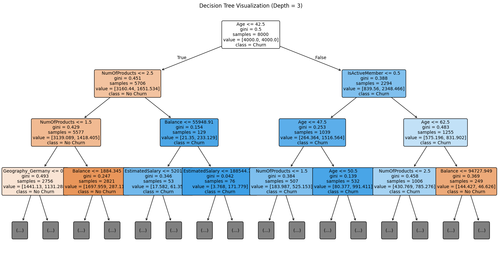

# Bank Customer Churn Prediction
This project aims to build a predictive model to identify bank customers at high risk of churning (i.e., closing their accounts). By leveraging machine learning techniques and customer profile data, we propose a data-driven approach to improve retention strategies and reduce revenue loss due to customer attrition.

Kaggle link: https://www.kaggle.com/datasets/shrutimechlearn/churn-modelling

# Business Context
XYZ Bank is a retail banking institution operating in France, Spain, and Germany. It offers a range of financial products including checking and savings accounts, credit cards, and investment services. Recently, the bank has observed a rise in customer churn, with a significant proportion of attrition occurring in the 30–60 age group.

- **Overall churn rate**: 4.2%
- **High-risk age segment**: 30–60 years old (88.27% of all churn cases)
- **Economic impact**: Based on industry benchmarks, the average customer lifetime value (LTV) is estimated at €1,800, and the customer acquisition cost (CAC) at €400. This implies a net loss of €1,400 for every customer who leaves the bank.

### Project Objectives

The project has both business and technical goals:

- **Business Objective**: Deploy a predictive system within the bank’s CRM that automatically triggers proactive retention protocols. These may include personalized offers, benefit adjustments, or alerts for at-risk customers based on model-driven segmentation.

- **Analytical Objective**: Develop a machine learning model with at least **85% prediction accuracy** to classify customers by churn risk. The goal is to reduce the overall churn rate by **at least 10%** over the next six months. The final model should be deployment-ready by the end of the current fiscal quarter.

## Results:

### Models Compared
- **Logistic Regression**: Easy to interpret, but lower predictive power.
- **Decision Tree**: Good balance between performance and explainability.
- **XGBoost**: Best overall performance.

### Key Result (XGBoost tuned model)
- **Accuracy**: 84.8%
- **F1-score (Churn)**: 0.62
- **AUC**: 0.85
- **Lift (Top 20%)**: ~3.5× better than random and **Gain (Top 20%)**: Captures ~60% of churners

### Strategic Insights
- High-balance clients with high salaries are more likely to churn.
- Customers over 43 years old or not actively engaged are at higher risk.
- German customers showed the highest churn probability.

### Business Impact
If 5,000 clients at high churn risk are contacted:
- **Retention cost**: €2,000,000 (5,000 × €400)
- **Potential loss avoided**: €9,000,000 (5,000 × €1,800)
- **Net benefit**: €7,000,000

---


### Dataset Overview

This dataset consists of 10,000 customer records from XYZ Bank. Each row represents a client and contains demographic, financial, and behavioral features. The target variable is `Exited`, indicating whether the customer has left the bank.

**Features:**


| Feature          | Type        | Description                                                  |
|------------------|-------------|--------------------------------------------------------------|
| `RowNumber`      | Integer     | Row index (for internal reference)                          |
| `CustomerId`     | Integer     | Unique ID assigned to each customer                         |
| `Surname`        | Text        | Customer’s last name                                        |
| `CreditScore`    | Integer     | Credit score assigned by the bank                           |
| `Geography`      | Categorical | Country of residence (France, Germany, Spain)               |
| `Gender`         | Categorical | Customer’s gender                                           |
| `Age`            | Integer     | Age of the customer                                         |
| `Tenure`         | Integer     | Number of years the customer has been with the bank         |
| `Balance`        | Float       | Account balance in euros                                    |
| `NumOfProducts`  | Integer     | Number of financial products used by the customer           |
| `HasCrCard`      | Binary      | Whether the customer owns a credit card (1 = Yes, 0 = No)   |
| `IsActiveMember` | Binary      | Whether the customer is considered active (1 = Yes, 0 = No) |
| `EstimatedSalary`| Float       | Estimated yearly salary                                     |
| `Exited`         | Binary      | Target variable: 1 if the customer left the bank, 0 if not  |

### 🔍 Exploratory Data Analysis (EDA)

Before beginning the analysis, we performed a basic data quality audit to ensure the dataset was suitable for modeling. We checked for missing values and found that all columns were complete, with zero null values across the entire dataset (10,000 records and 14 variables). This allowed us to proceed without requiring imputation or row removal.

**Steps:**

```python
# Check for missing values
data.isnull().sum()

# Check for duplicated rows
data.duplicated().sum()

# Basic statistics
data.describe()
```

We validated that the dataset has no missing values across any feature:

| Feature           | Missing Values |
|------------------|----------------|
| RowNumber         | 0              |
| CustomerId        | 0              |
| Surname           | 0              |
| CreditScore       | 0              |
| Geography         | 0              |
| Gender            | 0              |
| Age               | 0              |
| Tenure            | 0              |
| Balance           | 0              |
| NumOfProducts     | 0              |
| HasCrCard         | 0              |
| IsActiveMember    | 0              |
| EstimatedSalary   | 0              |
| Exited            | 0              |


### Univariate Statistical Summary

To better understand the distribution and characteristics of the dataset’s **numerical variables**, we computed basic descriptive statistics:

| Variable         | Mean      | Median    | SD        | CV (Mean) | CV (Median) | Skewness | Kurtosis | Min     | Max        | Range      |
|------------------|-----------|-----------|-----------|------------|--------------|----------|-----------|----------|-------------|------------|
| CreditScore      | 650.53    | 652.00    | 96.65     | 0.15       | 0.15         | -0.07    | -0.43     | 350.00   | 850.00      | 500.00     |
| Age              | 38.92     | 37.00     | 10.49     | 0.27       | 0.28         | 1.01     | 1.39      | 18.00    | 92.00       | 74.00      |
| Tenure           | 5.01      | 5.00      | 2.89      | 0.58       | 0.58         | 0.01     | -1.17     | 0.00     | 10.00       | 10.00      |
| Balance          | 76,485.89 | 97,198.54 | 62,397.40 | 0.82       | 0.64         | -0.14    | -1.49     | 0.00     | 250,898.09  | 250,898.09 |
| NumOfProducts    | 1.53      | 1.00      | 0.58      | 0.38       | 0.58         | 0.74     | 0.58      | 1.00     | 4.00        | 3.00       |
| EstimatedSalary  | 100,090.24| 100,193.91| 57,510.49 | 0.57       | 0.57         | 0.00     | -1.18     | 11.58    | 199,992.48  | 199,980.90 |

## Distribution of Numeric Variables


### Univariate Analysis – Key Insights of numeric variables

- **Balance:**  
  Average of €76,486 and standard deviation of €62,397 indicate **high dispersion**.  
  Slightly negative skewness (-0.14) and negative kurtosis (-1.48) suggest a **slightly left-skewed distribution** with thinner tails than a normal curve.  
  Several values are zero → may represent **clients with no active funds**, which could be relevant for churn prediction.

- **Age:**  
  Mean age is 38.9 years, with **positive skewness** (1.01) and **moderate kurtosis** (1.39).  
  The distribution leans toward younger clients but includes a **long tail of older customers**.  
  Ranging from 18 to 92 → age can be **segmented into groups** (e.g., young, adults, seniors) for churn analysis.

- **NumOfProducts:**  
  Mean is 1.53 with a median of 1 → most customers hold **only 1 or 2 products**.  
  Positive skewness (0.74) shows that **few customers have 3 or more products**.  
  This feature may reflect **relationship depth** or customer loyalty.

- **CreditScore:**  
  The distribution is **quite symmetric and stable** (skew ≈ 0, CV ≈ 0.15).  
  Ranges between 350 and 850, with no evident outliers → **clean and ready for modeling**.

- **EstimatedSalary:**  
  Average around €100,000 but with a **very wide range** (from €11.5 to €199,992).  
  No significant skewness → although due to high dispersion, **scaling or normalization** may be needed when using models sensitive to feature magnitude.
  
### Outlier Analysis

We performed boxplot-based outlier detection using the IQR method for key numerical features:

- **Age:**  
  - Detected **359 outliers** (3.59% of the dataset).  
  - Among them, **73 customers churned**, representing ~20.3%, slightly below the overall churn rate.  
  - These values mostly correspond to elderly customers (ages 61+), a minority group in the dataset.  
  - **Decision:** We chose to **retain these observations**, as their proportion is low and they provide potentially valuable insights for senior segment analysis.

- **CreditScore:**  
  - Only **15 outliers** detected (0.15% of the dataset).  
  - All 15 customers churned, but the sample size is **too small** to draw significant conclusions.  
  - **Decision:** Outliers were **retained**, as their presence is negligible and unlikely to distort model performance.

In both cases, we chose **not to remove or cap** the outliers due to their low frequency and limited impact on the predictive model. This decision preserves the integrity and representativeness of the dataset.


### Univariate Analysis – Categorical Variables

We analyzed the distribution of key categorical features to understand the composition of the customer base and identify any potential imbalance that could affect the modeling phase.

- **Geography:** About half of the bank’s clients are from France, while the remaining are evenly split between Spain and Germany.
- **Gender:** The gender distribution is nearly even, with a slight majority of male customers (~5% more than female).
- **Has Credit Card:** Approximately 70% of clients hold a credit card, while 30% do not. This could reflect differing levels of engagement with bank services.
- **Is Active Member:** Nearly half of the customers are not considered active members, which may indicate lower interaction or satisfaction with the bank.
- **Exited (Churn):** Around **20%** of customers have exited the bank, compared to **80%** who remain. This reveals a significant **class imbalance** that must be addressed in the modeling phase through techniques such as:
  - Threshold adjustment
  - Using robust metrics (e.g., AUC, F1-score, Lift)
  - Resampling strategies (oversampling, undersampling)

#### Categorical Variables Distribution


## Bivariate Analysis – Key Findings

We explored how the churn behavior (Exited) relates to other variables in the dataset. Key relationships emerged from the bivariate visualizations:

- **Age vs. Exited:**  
  Customers who left the bank tend to be significantly older, with a higher median age compared to those who stayed. This suggests age is an important factor in predicting churn.

- **Geography vs. Exited:**  
  Customers from **Germany** show the **highest churn rate**, while customers from France and Spain tend to remain with the bank. This may reflect regional satisfaction or policy differences.

- **NumOfProducts vs. Exited:**  
  Customers with **3 or more products** show disproportionately high churn. This is counterintuitive, as multi-product users are usually more loyal. It may indicate dissatisfaction with complex product bundles.

- **Correlation Matrix:**  
  The only strong correlation with `Exited` is **Age** (0.29). Other variables show very weak or negligible relationships, supporting the idea that **non-linear models** might better capture hidden patterns.

### Visual Insights

  
*Figure: Key bivariate plots (Age, Geography, NumOfProducts vs. Exited)*

<p align="center">
  
</p>

<p align="center"><em>Figure: Pearson correlation matrix between numerical features and churn</em></p>
## Data Preparation

Before training the model, we performed basic preprocessing steps to clean and prepare the dataset:

### 1. Feature Removal
We dropped three variables that were not relevant for predictive modeling:

- `RowNumber`: purely an index.
- `CustomerId`: a unique identifier with no predictive value.
- `Surname`: does not provide meaningful signal and could lead to unnecessary dimensionality if encoded.

```python
df.drop(columns=['RowNumber', 'CustomerId', 'Surname'], inplace=True)
```
### 🔤 2. Categorical Encoding

To prepare the categorical features for modeling, we applied the following encoding techniques:

- **Gender:** Binary label encoding where `"Male"` is encoded as `1` and `"Female"` as `0`.
- **Geography:** One-hot encoding to represent the countries (`France`, `Spain`, `Germany`) as separate binary variables. We retained all categories by setting `drop_first=False` to allow models to learn from the full set.

We also ensured that all dummy variables are of type `float`, which is required for compatibility with many machine learning models.

```python
# Label encoding for Gender
df['Gender'] = df['Gender'].map({'Male': 1, 'Female': 0}).astype(float)

# One-hot encoding for Geography (all categories kept)
df = pd.get_dummies(df, columns=['Geography'], drop_first=False)

# Ensuring dummy variables are floats
for col in df.columns:
    if df[col].dtype == 'bool':
        df[col] = df[col].astype(float)
```
### 3. Feature and Target Definition

We separated the dataset into features (`X`) and target variable (`y`) for supervised learning.

- **Target (`y`)**: The `Exited` column, which indicates whether the customer churned (1) or not (0).
- **Features (`X`)**: All remaining columns after dropping the non-informative variables and applying encoding.

We then split the dataset into training and testing subsets using stratified sampling to maintain the same class distribution of the target variable.

```python
# Define target and features
X = df.drop(columns='Exited')
y = df['Exited']

# Split into training and test sets with stratified sampling
from sklearn.model_selection import train_test_split

X_train, X_test, y_train, y_test = train_test_split(
    X, y, test_size=0.2, random_state=42, stratify=y
)
```
## Logistic Regression Model

We first implemented a **Logistic Regression** model to establish a solid baseline for churn prediction. The model was trained using `class_weight='balanced'` to address the class imbalance in the target variable (`Exited`), and we used **Youden’s Index** to determine an optimal classification threshold.

### Model Training

```python
from sklearn.linear_model import LogisticRegression
from sklearn.metrics import roc_curve, classification_report, confusion_matrix, roc_auc_score

# Train logistic regression with class balancing
logit_model = LogisticRegression(max_iter=1000, class_weight='balanced')
logit_model.fit(X_train, y_train)

# Predict probabilities
y_prob = logit_model.predict_proba(X_test)[:, 1]

# Compute ROC curve
fpr, tpr, thresholds = roc_curve(y_test, y_prob)

# Find optimal threshold using Youden's Index
j_scores = tpr - fpr
optimal_idx = j_scores.argmax()
optimal_threshold = thresholds[optimal_idx]

print(f"Optimal threshold: {optimal_threshold:.3f}")
```
**Optimal threshold found: 0.543**

Due to the class imbalance in our dataset (~20% churn), relying on the default threshold of 0.5 may not yield optimal results. To address this, we evaluated the model’s performance across different thresholds (ranging from 0.1 to 0.9), focusing on three key metrics: **Precision**, **Recall**, and **F1-score**.

The goal in this context is to **identify churn-prone customers** who are both likely to leave and worth retaining, which requires a **balanced trade-off between Precision and Recall**. Maximizing Recall alone would flag too many false positives, while focusing on Precision could miss valuable at-risk clients.

The threshold that achieved the **highest F1-score**, offering the best harmonic balance between Precision and Recall, was selected and applied to the final predictions.

<p align="center">
  
</p>

### Model Evaluation - Logistic Regression

Predictions were made using the adjusted threshold of **0.543**. Below is the confusion matrix and classification report:

#### Confusion Matrix

|                 | **Predicted: Stayed** | **Predicted: Churned** |
|-----------------|-----------------------|-------------------------|
| **Actual: Stayed**   | 1217                  | 376                     |
| **Actual: Churned**  | 145                   | 262                     |

#### Classification Report

| Metric        | Class: Stayed (0) | Class: Churned (1) |
|---------------|-------------------|---------------------|
| Precision     | 0.89              | 0.41                |
| Recall        | 0.76              | 0.64                |
| F1-score      | 0.82              | 0.50                |
| Support       | 1593              | 407                 |

- **Accuracy:** 0.74
- **AUC**: 0.77


Despite addressing class imbalance and tuning the decision threshold for optimal F1-score, the model still shows **low precision** for identifying churners. This suggests that the **logistic regression model may be too limited** to capture the underlying patterns. Improving performance could require more powerful classifiers and/or advanced **feature engineering**.

<p align="center">
  
</p>
<p align="center"><em>Figure: ROC curve showing model performance across thresholds</em></p>

### Logistic Regression – Coefficient Analysis

The table below shows the coefficients from the logistic regression model along with their statistical significance:

| Feature              | Coefficient | P-value | Interpretation |
|----------------------|-------------|---------|----------------|
| **IsActiveMember**   | -1.03       | 0.000   | Strongest negative effect on churn; active members are less likely to leave. |
| **Gender (Male)**    | -0.52       | 0.000   | Men are less likely to churn compared to women. |
| **Geography_Germany**| +0.82       | 0.000   | Customers from Germany are significantly more likely to churn. |
| **Age**              | +0.07       | 0.000   | Churn probability increases with age. |
| **Balance**          | +0.000003   | 0.000   | Higher balances slightly increase churn likelihood (marginal effect). |
| **CreditScore**      | -0.0009     | 0.004   | Lower credit scores increase churn probability. |
| **NumOfProducts**    | -0.12       | 0.022   | Customers with more products are less likely to churn. |
| **Geography_Spain**  | +0.045      | 0.570   | Not statistically significant. |
| **Tenure**           | -0.007      | 0.504   | Not statistically significant. |
| **HasCrCard**        | -0.071      | 0.284   | Not statistically significant. |
| **EstimatedSalary**  | +0.0000008  | 0.116   | Not statistically significant. |

**Key Takeaways:**
- The strongest **predictors of churn** are customer activity (`IsActiveMember`), age, geography (especially Germany), and gender.
- **Non-significant features** (e.g., tenure, credit card ownership, estimated salary) contribute little to the model's explanatory power and could potentially be excluded or transformed in future iterations.
- These coefficients are **interpreted in log-odds**, so their effect on probability is not linear but directionally meaningful.

<p align="center">
  
</p>
<p align="center"><em>Figure: Feature importance based on logistic regression coefficients</em></p>

**Lift Curve - Logistic Regresion**

<p align="center">
  
</p>
<p align="center"><em>Figure: Lift Curve - Logistic Regression</em></p>

The **Lift Curve** shows that the logistic regression model significantly outperforms random targeting, especially in the top customer deciles. For example, contacting the top 10% most likely churners yields up to **3.5 times** more actual churners than a random selection.  
This highlights the model's practical value for **targeted retention strategies** and confirms its utility even with moderate predictive power.

## Decision Tree Classifier

### Model Training

The Decision Tree model was trained using the `sklearn.tree.DecisionTreeClassifier`, applying **class balancing** to address the churn imbalance in the dataset. The model was fitted on the training set and used to generate both predicted classes and churn probabilities for evaluation.

```python
from sklearn.tree import DecisionTreeClassifier
from sklearn.metrics import classification_report, confusion_matrix, roc_auc_score

tree_model = DecisionTreeClassifier(random_state=42, class_weight='balanced')
tree_model.fit(X_train, y_train)

y_pred_tree = tree_model.predict(X_test)
y_prob_tree = tree_model.predict_proba(X_test)[:, 1]
```
## Decision Tree – Preliminary Evaluation

After training a basic Decision Tree classifier using a balanced class weight strategy, we evaluated its performance on the test set.

### Results
- **Confusion Matrix**:

|                 | **Predicted: Stayed** | **Predicted: Churned** |
|-----------------|-----------------------|-------------------------|
| **Actual: Stayed**   | 1359                  | 234                     |
| **Actual: Churned**  | 217                   | 190                     |

- **Classification Report**:
- Precision (Stayed): **0.86**
- Recall (Stayed): **0.85**
- Precision (Churned): **0.45**
- Recall (Churned): **0.47**
- Accuracy: **0.77**
- AUC: **0.660**

The results suggest that the decision tree performs slightly better than a naive classifier, but still struggles to identify churned customers effectively.

### First ROC Curve

<p align="center">
  
</p>

*Figure: ROC Curve for baseline Decision Tree model*

### Model Optimization: Decision Tree

To enhance the performance of the baseline decision tree model, we performed hyperparameter tuning using **GridSearchCV** with 5-fold cross-validation. The goal was to optimize the model based on the **F1-score**, which balances precision and recall — a key priority due to the class imbalance in our dataset.

The hyperparameters we tuned were:

- `max_depth`: Controls the maximum depth of the tree  
- `min_samples_split`: Minimum number of samples required to split an internal node  
- `min_samples_leaf`: Minimum number of samples required to be at a leaf node  
- `max_features`: Number of features to consider when looking for the best split

from sklearn.model_selection import GridSearchCV
from sklearn.tree import DecisionTreeClassifier

```python
param_grid = {
    'max_depth': [3, 4, 5, 6, 7, 8],
    'min_samples_split': [2, 5, 10],
    'min_samples_leaf': [1, 3, 5],
    'max_features': [None, 'sqrt', 'log2']
}

tree = DecisionTreeClassifier(random_state=42, class_weight='balanced')
grid_search = GridSearchCV(tree, param_grid, cv=5, scoring='f1', n_jobs=-1)
grid_search.fit(X_train, y_train)

print("Mejores hiperparámetros:", grid_search.best_params_)

```

After training, we used the **best estimator** returned by GridSearch to predict probabilities on the test set. Using a decision threshold of **0.64** (previously determined for better F1-score balance), we classified the final outputs and evaluated model performance.

<p align="center">
  
</p>

```python
# Final classification with optimal tree
y_prob = grid_search.best_estimator_.predict_proba(X_test)[:, 1]
y_pred_final = (y_prob >= 0.64).astype(int)
```

### Final Evaluation – Tuned Decision Tree

After tuning hyperparameters using GridSearchCV, the decision tree model showed improved performance compared to the logistic regression baseline.

#### Confusion Matrix
|               | Predicted: No Churn | Predicted: Churn |
|---------------|---------------------|------------------|
| Actual: No Churn | 1429                | 164              |
| Actual: Churn    | 162                 | 245              |

#### Classification Report

- **Accuracy:** 84%
- **Precision:** 0.60 (for churn class)
- **Recall:** 0.60 (for churn class)
- **F1-score:** 0.60 (for churn class)
- **AUC-ROC:** ~0.81

This model presents a **balanced improvement in both precision and recall** for the churn class (positive class), reaching an **F1-score of 0.60** and a strong **AUC-ROC of 0.81**, outperforming the logistic regression model. The confusion matrix shows that the model is better at capturing churned clients without excessively misclassifying non-churned ones. This makes it a **more robust tool for retention strategies**, with a more reliable risk segmentation than simpler linear models.

### Feature Importance – Decision Tree


*Figure: Variable importance scores from the tuned Decision Tree classifier.*

The plot above displays the importance of each feature based on the trained Decision Tree. These scores reflect how much each variable contributed to splitting the data and improving the model’s ability to distinguish between churned and retained customers.

- **Age** stands out as the most influential feature, indicating that older clients are more likely to leave the bank.
- **Balance** and **Credit Score** also played important roles in determining churn.
- On the other hand, variables like **Geography**, **Gender**, and **HasCrCard** had relatively low importance, suggesting they contributed little to the model's decision-making.

### Lift Curve – Classification Tree


*Figure: Lift Curve of the tuned Decision Tree model.*

The lift curve demonstrates how effective our model is at identifying likely churners compared to a random selection. At the start, the lift exceeds **4.5**, meaning that the top-ranked customers are over 4.5 times more likely to churn than average.

This behavior is especially useful in business contexts where we want to **target a limited percentage of clients** (e.g., top 10–20%) for retention campaigns. The model allows us to allocate resources more efficiently by prioritizing high-risk customers.

### Gain Curve – Classification Tree


*Figure: Gain curve illustrating the effectiveness of the decision tree model in identifying churners compared to a random strategy.*

The gain curve shows that the classification tree significantly outperforms random selection. By targeting just **20% of the clients**, the model captures **more than 60%** of churners. This demonstrates the model’s ability to effectively prioritize high-risk customers, making it a valuable tool for **resource allocation and targeted retention strategies**.

### Decision Tree Visualization and Rule Extraction



*Figure: Pruned visualization of the decision tree used to predict customer churn.*

The tree provides interpretable decision paths that help explain customer churn behavior. Some key insights include:

- **Younger customers (Age ≤ 42.5)** with **fewer products (≤ 2)** and **low balances (≤ 1,884.34)** are likely to **stay**.
- Clients with **high balances (> 55,948.91)** and **higher salaries (> 188,544.7)** are at **greater risk of churn**, even if they are younger.
- For **older clients (Age > 42.5)**:
  - **Inactive members** with **few products** or **higher ages (> 50.5)** are more likely to **churn**.
  - **Active members** tend to stay, unless they have **high balances** and **many products**.

## XG Boost Model

### XGBoost – Initial Model Training

We started by training a base **XGBoost classifier** using default parameters, with the addition of `scale_pos_weight` to address the class imbalance (only ~20% of customers churned). The model was trained on the full training dataset without feature scaling.

```python
from xgboost import XGBClassifier
from sklearn.metrics import classification_report, confusion_matrix, roc_auc_score

xgb_model = XGBClassifier(
    objective='binary:logistic',
    eval_metric='logloss',
    use_label_encoder=False,
    random_state=42,
    scale_pos_weight=(len(y_train[y_train == 0]) / len(y_train[y_train == 1]))
)

xgb_model.fit(X_train, y_train)

y_pred = xgb_model.predict(X_test)
y_prob = xgb_model.predict_proba(X_test)[:, 1]
```
### Initial Results – XGBoost Classifier

|                  | Predicted: No Churn | Predicted: Churn |
|------------------|---------------------|------------------|
| **Actual: No**   | 1393                | 200              |
| **Actual: Yes**  | 155                 | 252              |

**Classification Metrics:**

| Metric            | Class 0 (No Churn) | Class 1 (Churn) |
|-------------------|--------------------|------------------|
| Precision         | 0.90               | 0.56             |
| Recall            | 0.87               | 0.62             |
| F1-score          | 0.89               | 0.59             |
| **Accuracy**      |                    | **0.82**         |
| **ROC AUC Score** |                    | **0.836**        |

---

- The model correctly identifies most non-churners and over half of the churners. Good overall accuracy (82%) and strong AUC score (0.836). This gives us a solid starting point before tuning the model.

---

## XGBoost – Hyperparameter Tuning

After an initial training phase, we used a **Grid Search with cross-validation (cv=5)** to identify the best set of hyperparameters based on F1-score performance. The optimal configuration found was:

```python
xgb_best = XGBClassifier(
    objective='binary:logistic',
    eval_metric='logloss',
    use_label_encoder=False,
    random_state=42,
    scale_pos_weight=(len(y_train[y_train == 0]) / len(y_train[y_train == 1])),  # To address class imbalance
    n_estimators=100,
    max_depth=7,
    learning_rate=0.1,
    min_child_weight=1,
    subsample=0.8,
    colsample_bytree=0.8
)
```
### Optimal Threshold Selection

Again, due to the class imbalance in the dataset, relying on the default threshold of 0.5 may not yield the best balance between Precision and Recall. To address this, we evaluated the model's performance across a range of thresholds (from 0.1 to 0.9), focusing on **Precision**, **Recall**, and **F1-score**. The threshold that **maximized the F1-score** was selected as the optimal cut-off point for final predictions.

```python
best_idx = np.argmax(f1_scores)
best_threshold = thresholds[best_idx]
print(f"Best threshold by F1-score: {best_threshold:.3f}")
```

-  **Best Threshold Identified:** `0.590`

This value represents the best compromise between capturing true churners and avoiding false positives.

<p align="center">
  
</p>

*Figure: Precision, Recall and F1-score vs Threshold – XGBoost*


### Tuned XGBoost – Evaluation

After applying hyperparameter tuning and selecting the optimal classification threshold (0.59), we evaluated the final performance of the XGBoost model on the test set:

### Confusion Matrix

|               | Predicted: No Churn | Predicted: Churn |
|---------------|---------------------|------------------|
| **Actual: No Churn** | 1446                | 147              |
| **Actual: Churn**    | 157                 | 250              |

### Classification Metrics

- **Accuracy**: 85%
- **Precision**: 
  - Class 0 (No Churn): 90%
  - Class 1 (Churn): 63%
- **Recall**: 
  - Class 0 (No Churn): 91%
  - Class 1 (Churn): 61%
- **F1-Score**:
  - Class 0 (No Churn): 90%
  - Class 1 (Churn): 62%
- **AUC Score**: **0.854**

The tuned XGBoost model shows **balanced performance**, particularly improving recall and F1-score for the **churn class** compared to previous models. This makes it well-suited for **prioritizing customer retention strategies** by better identifying likely churners, while maintaining strong overall accuracy.

### Lift Curve – XGBoost (Tuned)

The Lift Curve illustrates how much better our model performs compared to random targeting.

As shown in the plot below, the **XGBoost model** provides a strong uplift in the early deciles. Specifically, the top 10–20% of customers ranked by predicted probability are **up to 4.8 times** more likely to churn than a randomly selected group.

This validates the model's value in **targeted retention strategies**, enabling the business to prioritize high-risk customers effectively.

<p align="center">
  
</p>

*Figure: Lift curve showing model performance over random selection*

### Feature Importance – XGBoost (Tuned Model)

The chart below displays the importance of each variable as determined by the XGBoost model.

The top features driving churn prediction are:

- **NumOfProducts**: Most influential predictor. Clients with fewer products are more likely to churn.
- **IsActiveMember**: Inactivity strongly correlates with churn risk.
- **Age** and **Geography_Germany**: Older clients and those located in Germany show higher churn tendencies.
- **Balance** and **Gender** also play relevant roles, though with lower weight.

<p align="center">
  
</p>

*Figure: Feature importance plot from XGBoost tuned model*

### Gain Curve – XGBoost


The Gain Curve shows how effectively the XGBoost model identifies churners when prioritizing clients based on predicted probability.

- By contacting the top **20%** of customers ranked by model confidence, we capture around **60%** of actual churners.
- The curve consistently stays above the diagonal (random selection), indicating solid performance in targeting efforts.
- This makes XGBoost a strong candidate for marketing or retention campaigns, allowing the company to focus resources on high-risk customers with better precision.

###  Model Performance Comparison

| Metric              | Logistic Regression | Decision Tree        | XGBoost                |
|---------------------|---------------------|----------------------|------------------------|
| **Accuracy**        | 0.74                | 0.84                 | **0.85**               |
| **Precision (Churn)** | 0.41              | 0.60                 | **0.63**               |
| **Recall (Churn)**    | **0.64**           | 0.60                 | 0.61                   |
| **F1-Score (Churn)**  | 0.50               | 0.60                 | **0.62**               |
| **AUC-ROC**         | 0.77                | 0.81                 | **0.85**               |

---


- **XGBoost** outperforms the other models in most metrics, achieving the best **accuracy**, **precision**, **F1-score**, and **AUC**.
- **Logistic Regression** offers reasonable recall, but significantly underperforms in precision and overall classification power.
- **Decision Tree** balances interpretability and performance, slightly behind XGBoost but still effective, especially in scenarios where explainability is crucial.


---

## Conclusions and Recommendations

The objective of this analysis was to help the bank identify customers with the **highest probability of churn**, in order to implement **targeted retention strategies** that are both cost-effective and impactful.

### Key Takeaways

- Using a **random strategy**, contacting 20% of clients at random would likely reach only ~20% of churners (given the class imbalance).
- However, using our **XGBoost model**, we can contact the **top 20% of clients with the highest predicted probability of churn** and capture over **60% of actual churners**, as shown by the **Gain Curve**.
- The **Lift Curve** confirms that this model delivers **more than 3x the performance of random targeting**, making it the ideal tool to **prioritize outreach and allocate retention resources efficiently**.

---

### Model Strategy

- **XGBoost** showed the **best predictive performance** across all models, making it the optimal choice for practical deployment.
- **Logistic Regression** and **Decision Tree**—while slightly less accurate—offer **valuable interpretability** that can guide **data-driven marketing and customer strategy**.

---

### Strategic Insights from Models

- **High-balance and high-income customers** show surprisingly high churn rates. These valuable clients may not find current offerings attractive, suggesting a need for **premium retention campaigns**.
- **Older clients (over 43 years)** are also more likely to leave, as identified by the decision tree. Designing **age-specific engagement strategies** could help reduce churn in this segment.
- **Inactive members** (low engagement) are significantly more likely to churn—highlighted clearly by the logistic model.
- **German clients** have notably higher churn probabilities, possibly due to product-market fit or service differences. This group warrants **further investigation**.
- **Male customers** appear more likely to stay, though further research is needed to understand the behavioral patterns behind this trend.

---

---

## Business Value Estimation

Let’s estimate the **financial impact** of deploying the model in a real-world retention campaign.

### Assumptions:
- The model is used to **contact the top 5,000 clients** predicted as most likely to churn.
- **Retention cost per client** (e.g., phone calls, offers): **€400**
- **Estimated value retained per client**: **€1,800**
- Thus, **net value per retained client** = €1,800 - €400 = **€1,400**

### Potential Impact:
If the model helps us retain **5,000 customers**, the bank could prevent the loss of:

- **Total cost of contacting**: 5,000 × €400 = **€2,000,000**
- **Total value retained**: 5,000 × €1,800 = **€9,000,000**
- **Net gain (after costs)**: 5,000 × €1,400 = **€7,000,000**
---

## Recommendation: A/B Testing for Pilot Phase

To validate the model’s effectiveness before full deployment, we propose an **A/B test**:
- **Group A**: 5,000 high-risk clients identified by the model.
- **Group B**: 5,000 randomly selected clients (control).
  
Track the **churn rate**, **conversion**, and **cost per retention** in each group over a period (e.g., 1–3 months).

This will help demonstrate:
- The **lift over random targeting**.
- The **real-world ROI** of the model.

---
##  Final Assessment: Did We Meet Our Goals?

The primary objective was to help the bank **identify customers with high probability of churn** in order to **prioritize retention efforts** efficiently.

### Model Accuracy
The final **XGBoost model** achieved an accuracy of:

**Accuracy** = `(TP + TN) / Total` = `(1446 + 250) / 2000` = **84.8%**

This is a solid performance given the class imbalance, and confirms the model's reliability in real-world use.
